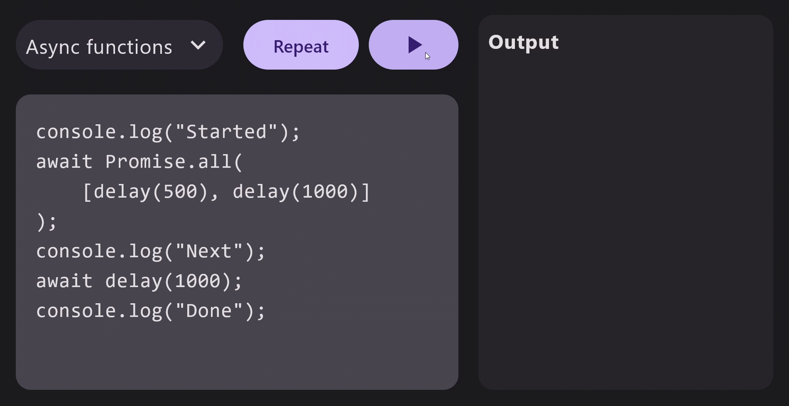

<div align="center">
<h1> QuickJS - KT </h1>

<p>Run your JavaScript code in Kotlin, asynchronously.</p>

</div>

This is a [QuickJS](https://bellard.org/quickjs/) binding for idiomatic Kotlin, inspired by Cash App's [Zipline](https://github.com/cashapp/zipline) (previously Duktape Android) but with more flexibility.

### Another QuickJS wrapper?

There are a few QuickJS wrappers for Android already. Some written in Java are not Kotlin Multiplatform friendly, and some lack updates.

Zipline is great and KMP-friendly, but it focuses on running Kotlin/JS modules. Its API is limited to running arbitrary JavaScript code with platform bindings.

That's why I created this library, with some good features:

- Simple and idiomatic Kotlin APIs, it's easy to define binding and evaluate arbitrary code
- Highly integrated with **Kotlin Coroutines**, it is `async` and `suspend`ed. See [#Async](#async)
- Kotlin Multiplatform targets, including `Android`, `JVM` and `Kotlin/Native`
- The latest version of QuickJS

# Usages

### Installation

In `build.gradle.kts`:

```kotlin
implementation("io.github.dokar3:quickjs-kt:<VERSION>")
```

Or in `libs.versions.toml`:

```toml
quickjs-kt = { module = "io.github.dokar3:quickjs-kt", version = "<VERSION>" }
```

### Evaluate

with DSL (This is recommended if you don't need long-live instances):

```kotlin
coroutineScope.launch {
    val result = quickJs {
        evaluate<Int>("1 + 2")
    }
}
```

without DSL:

```kotlin
val quickJs = QuickJs.create(Dispatchers.Default)

coroutineScope.launch {
    val result = quickJs.evaluate<Int>("1 + 2")
    quickJs.close()
}
```

Evaluate the compiled bytecode:

```kotlin
coroutineScope.launch {
    quickJs {
        val bytecode = compile("1 + 2")
        val result = evaluate<Int>(bytecode)
    }
}
```

### Bindings

With DSL:

```kotlin
quickJs {
    define("console") {
        function("log") { args ->
            println(args.joinToString(" "))
        }
    }

    function("fetch") { args ->
        someClient.request(args[0])
    }

    function<String, String>("greet") { "Hello, $it!" }

    evaluate<Any?>(
        """
        console.log("Hello from JavaScript!")
        fetch("https://www.example.com")
        greet("Jack")
        """.trimIndent()
    )
}
```

With Reflection (JVM only):

```kotlin
class Console {
    fun log(args: Array<Any?>) = TODO()
}

class Http {
    fun fetch(url: String) = TODO()
}

quickJs {
    define<Console>("console", Console())
    define<Http>("http", Http())

    evaluate<Any?>(
        """
        console.log("Hello from JavaScript!")
        http.fetch("https://www.example.com")
        """.trimIndent()
    )
}
```

Binding classes need to be added to Android's ProGuard rules files.

```
-keep class com.example.Console { *; }
-keep class com.example.Http { *; }
```

### Async

This library gives you the ability to define [async functions](https://developer.mozilla.org/en-US/docs/Web/JavaScript/Reference/Statements/async_function). Within the `QuickJs` instance, a coroutine scope is created to launch async jobs, a job `Dispatcher` can also be passed when creating the instance.

`evaluate()` and `quickJs{}` are `suspend` functions, which make your async jobs await in the caller scope. All pending jobs will be canceled when the caller scope is canceled or the instance is closed.

To define async functions, easily call `asyncFunction()`:

```kotlin
quickJs {
    define("http") {
        asyncFunction("request") {
            // Call suspend functions here
        }
    }

    asyncFunction("fetch") {
        // Call suspend functions here
    }
}
```

In JavaScript, you can use the top level await to easily get the result:

```javascript
const resp = await http.request("https://www.example.com");
const next = await fetch("https://www.example.com");
```

Or use `Promise.all()` to run your request concurrently!

```javascript
const responses = await Promise.all([
    fetch("https://www.example.com/0"),
    fetch("https://www.example.com/1"),
    fetch("https://www.example.com/2"),
])
```

### Modules

[ES Modules](https://developer.mozilla.org/en-US/docs/Web/JavaScript/Guide/Modules) are supported when `evaluate()` or `compile()` has the parameter `asModule = true`.

```kotlin
quickJs {
    // ...
    evaluate<String>(
        """
            import * as hello from "hello";
            // Use hello
        """.trimIndent(),
        asModule = true,
    )
}
```

Modules can be added using `addModule()`  functions, both code and QuickJS bytecode are supported.

```kotlin
quickJs {
    val helloModuleCode = """
        export function greeting() {
            return "Hi from the hello module!";
        }
    """.trimIndent()
    addModule(name = "hello", code = helloModuleCode)
    // OR
    val bytecode = compile(
        code = helloModuleCode,
        filename = "hello",
        asModule = true,
    )
    addModule(bytecode)
    // ...
}
```

When evaluating ES module code, no return values will be captured, you may need a function binding to receive the result.

```kotlin
quickJs {
    // ...
    var result: Any? = null
    function("returns") { result = it.first() }

    evaluate<Any?>(
        """
            import * as hello from "hello";
            // Pass the script result here
            returns(hello.greeting());
        """.trimIndent(),
        asModule = true,
    )
    assertEquals("Hi from the hello module!", result)
}
```

### Alias

Want shorter DSL names?

```kotlin
quickJs {
    def("console") {
        prop("level") {
            getter { "DEBUG" }
        }

        func("log") { }
    }

    func("fetch") { "Hello" }

    asyncFunc("delay") { delay(1000) }

    eval<Any?>("fetch()")
    eval<Any?>(compile(code = "fetch()"))
}
```

Use the DSL aliases then!

```diff
-import com.dokar.quickjs.binding.define
-import com.dokar.quickjs.binding.function
-import com.dokar.quickjs.binding.asyncFunction
-import com.dokar.quickjs.evaluate
+import com.dokar.quickjs.alias.def
+import com.dokar.quickjs.alias.func
+import com.dokar.quickjs.alias.asyncFunc
+import com.dokar.quickjs.alias.eval
+import com.dokar.quickjs.alias.prop
```

# Type mappings

Some built-in types are mapped automatically between C and Kotlin, this table shows how they are
mapped.

| JavaScript type | Kotlin type                           |
|-----------------|---------------------------------------|
| null            | null                                  |
| undefined       | null (1)                              |
| boolean         | Boolean                               |
| Number          | Long/Int/Short/Byte, Double/Float (2) |
| string          | String                                |
| Array           | List<Any?>                            |
| Set             | Set<Any?>                             |
| Map             | Map<Any?, Any?>                       |
| Error           | Error                                 |
| object          | JsObject                              |
| Int8Array       | ByteArray                             |
| UInt8Array      | UByteArray                            |

(1) A Kotlin `Unit` will be mapped to a JavaScript `undefined`, conversely, JavaScript `undefined` won't be mapped to Kotlin `Unit`.

(2) When converting a JavaScript `Number` to Kotlin `Int`, `Short`, `Byte` or `Float` and the value is out of range, it will throw

### Custom types

`TypeConverter`s are used to support mapping non-built-in types. You can implement your own type
converters:

```kotlin
data class FetchParams(val url: String, val method: String)

// interface JsObjectConverter<T : Any?> : TypeConverter<JsObject, T>
object FetchParamsConverter : JsObjectConverter<FetchParams> {
    override val targetType: KType = typeOf<FetchParams>()

    override fun convertToTarget(value: JsObject): FetchParams = FetchParams(
        url = value["url"] as String,
        method = value["method"] as String,
    )

    override fun convertToSource(value: FetchParams): JsObject =
        mapOf("url" to value.url, "method" to value.method).toJsObject()
}

quickJs {
    addTypeConverters(FetchParamsConverter)

    asyncFunction<FetchParams, String>("fetch") {
        // Use the typed fetch params
        val (url, method) = it
        TODO()
    }

    val result = evaluate<String>(
       """await fetch({ url: "https://example.com", method: "GET" })"""
    )
}
```

You can also use the converter from `quickjs-kt-converter-ktxserialization`
and `quickjs-kt-convereter-moshi` (JVM only).

1. Add the dependency

    ```kotlin
    implementation("io.github.dokar3:quickjs-kt-converter-ktxserialization:<VERSION>")
    // Or use the moshi converter
    implementation("io.github.dokar3:quickjs-kt-converter-moshi:<VERSION>")
    ```

2. Add the type converters of your classes

    ```kotlin
    import com.dokar.quickjs.conveter.SerializableConverter
    // For moshi
    import com.dokar.quickjs.conveter.JsonClassConverter

    @kotlinx.serialization.Serializable
    // For moshi
    @com.squareup.moshi.JsonClass(generateAdapter = true)
    data class FetchParams(val url: String, val method: String)

    quickJs {
        addTypeConverters(SerializableConverter<FetchParams>())
        // For moshi
        addTypeConverters(JsonClassConverter<FetchParams>())

        asyncFunction<FetchParams, String>("fetch") {
            // Use the typed fetch params
            val (url, method) = it
            TODO()
        }
   
        val result = evaluate<String>(
            """await fetch({ url: "https://example.com", method: "GET" })"""
        )
   }
   ```

> [!NOTE]
> Functions with generic <T, R> require exactly 1 parameter on the JS side, it will throw if no parameter is passed or multiple parameters are passed.

# Error handling

Most of functions may throw:

- `IllegalStateException`, if some function was called after calling `close`

`evaluate()` and `compile()` may throw:

- `QuickJsException`, if a JavaScript error occurred or failed to map a type between JavaScript and Kotlin
- Other exceptions, if they were occurred in the Kotlin binding

If you find other suspicious errors, please feel free to open an issue to report

# Samples

- **[js-eval](./samples/js-eval)**: A GUI Compose Multiplatform app to evaluate JS, some minimal JS snippets are builtin
- **[js-eval-android](./samples/js-eval-android)**: The Android version of the `js-eval` sample
- **[openai](./samples/openai)**: Like `js-eval` but it has some Web API polyfills to run the bundled [openai-node](https://github.com/openai/openai-node)
- **[openai-android](./samples/openai-android)**: The Android version of the `openai` sample
- **[repl](./samples/repl)**: Simple Multiplatform REPL command line tool using [clikt](https://github.com/ajalt/clikt)

# Development

You may need these tools to build and run this project:

- Java JDK, both Windows, macOS, and Linux JDKs are required if you do a cross-compiling
- Android SDK and NDK
- [CMake](https://cmake.org/) The build system
- [Ninja](https://ninja-build.org/) The build generator for CMake
- [Zig](https://ziglang.org/) For cross-compiling the JNI libraries

# License

```
Copyright 2024 dokar3

Licensed under the Apache License, Version 2.0 (the "License");
you may not use this file except in compliance with the License.
You may obtain a copy of the License at

    http://www.apache.org/licenses/LICENSE-2.0

Unless required by applicable law or agreed to in writing, software
distributed under the License is distributed on an "AS IS" BASIS,
WITHOUT WARRANTIES OR CONDITIONS OF ANY KIND, either express or implied.
See the License for the specific language governing permissions and
limitations under the License.
```
